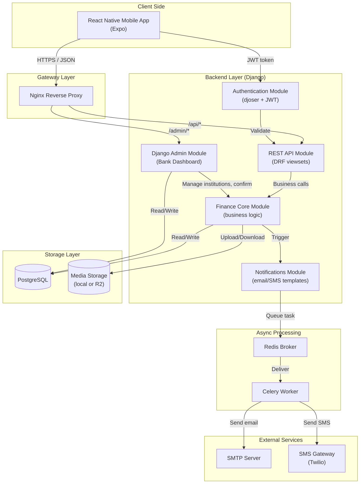
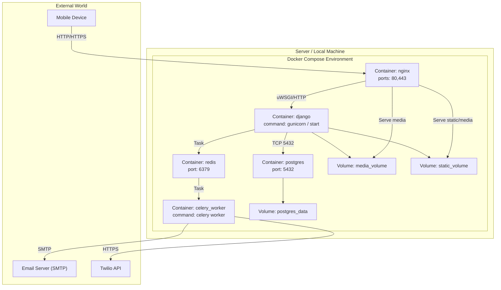
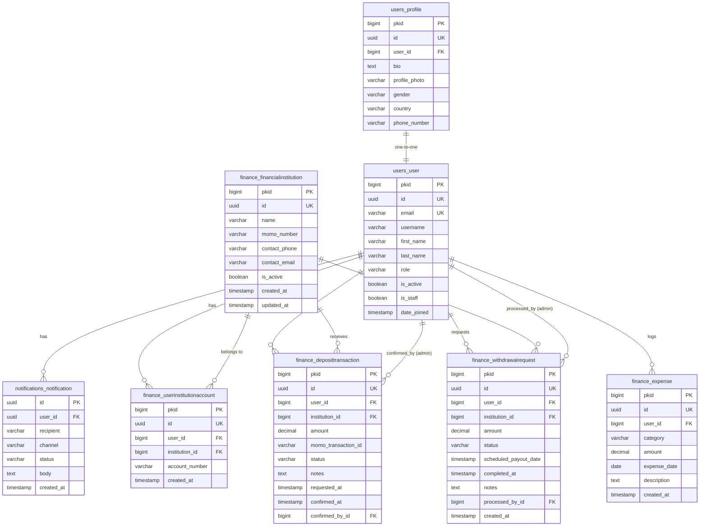
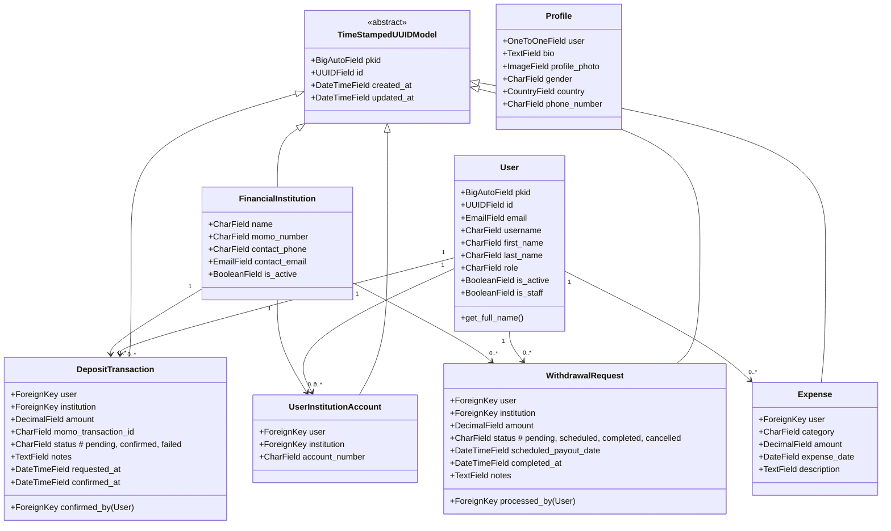
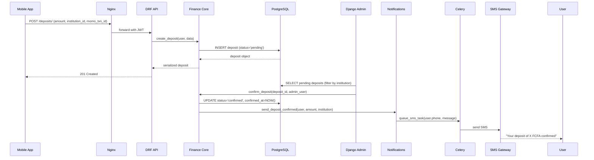
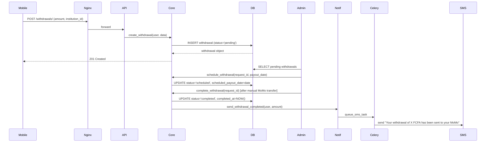
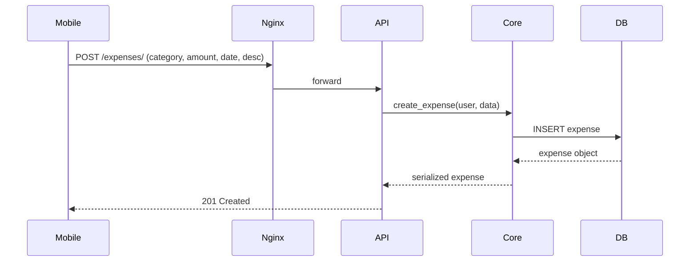
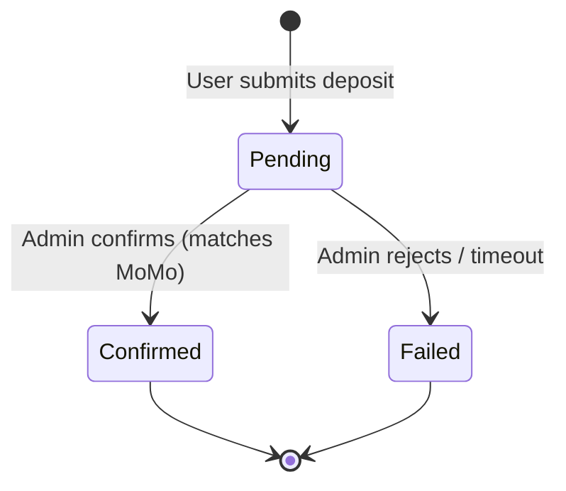
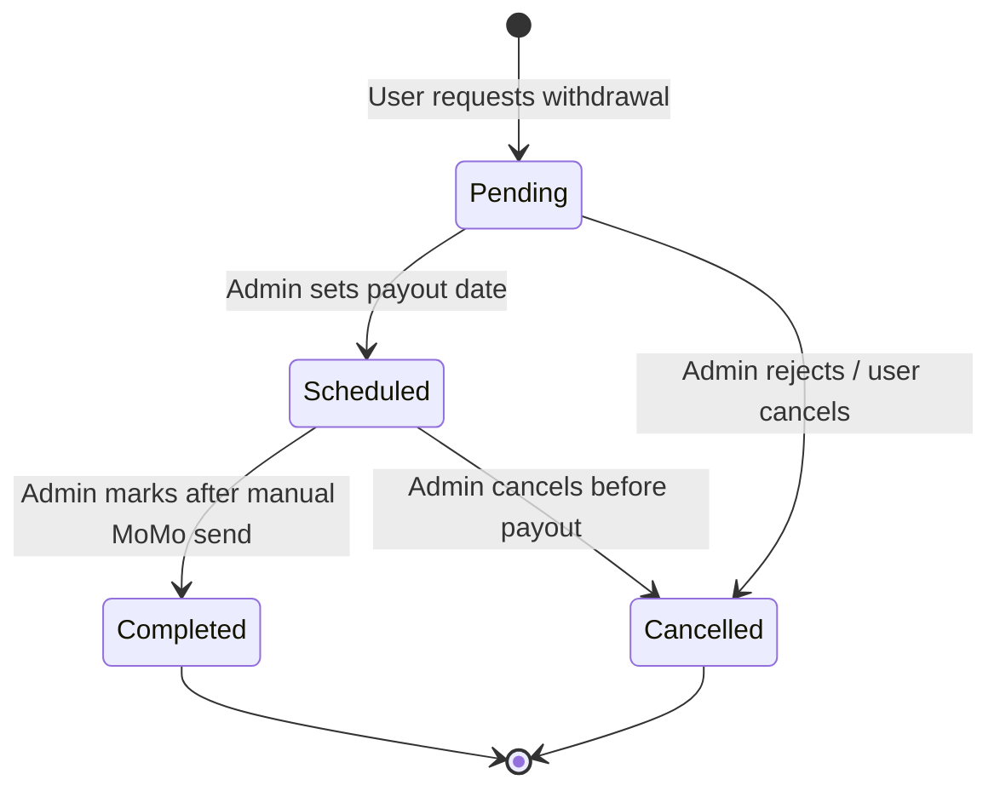

# SmartSave, Complete System Documentation

> This document contains every diagram required to understand the SmartSave personal finance management system:  
> **Component architecture, deployment, ER diagram, class diagram, sequence diagrams, and state machines.**  
> All diagrams use Mermaid syntax and are frozen for the project duration.

---

## 1. System Component Architecture (Logical Modules & Communication)

**Communication summary:**

- **Mobile ↔ Nginx:** HTTPS only.
- **Nginx ↔ Django API/Admin:** HTTP over internal Docker network.
- **Django ↔ PostgreSQL:** TCP port 5432, credentials from env.
- **Django ↔ Redis:** TCP port 6379 (message broker).
- **Celery ↔ Redis:** Same as above.
- **Celery ↔ SMTP/SMS:** Outbound connections (SMTP over TLS, Twilio API over HTTPS).

---

## 2. Deployment Diagram (Docker Containers & External)

**Container notes:**

- All containers share the Docker network `finance_manager-network`.
- `nginx` acts as reverse proxy; it also serves static files directly.
- `django` container runs Gunicorn (production) or `runserver` (dev override).
- `celery_worker` uses same image as django, with different command.
- `redis` no persistent volume – cache/message broker only.
- `postgres` uses named volume for data persistence.

---

## 3. Entity‑Relationship (ER) Diagram, Database

**Index notes (for performance):**
- `finance_deposittransaction (status, institution_id)`
- `finance_withdrawalrequest (status, institution_id)`
- `finance_expense (user_id, expense_date)`

---

## 4. Class Diagram (Main Django Models)

---

## 5. Sequence Diagrams (Key Flows)

### 5.1 Deposit Request & Confirmation

### 5.2 Withdrawal Request & Completion

### 5.3 Expense Logging

---

## 6. State Machine Diagrams

### 6.1 DepositTransaction States

**Transitions:**
- `Pending → Confirmed` – bank admin sees transaction ID and confirms.
- `Pending → Failed` – bank admin marks as fraudulent or no matching MoMo.
- No other transitions.

### 6.2 WithdrawalRequest States

**Transitions:**
- `Pending → Scheduled` – bank admin assigns a date.
- `Pending → Cancelled` – bank rejects (insufficient funds, etc.).
- `Scheduled → Completed` – after admin actually sends MoMo.
- `Scheduled → Cancelled` – if admin changes mind (rare).

---

## 7. Component Interface Table (APIs & Events)

| Module | Input interface | Output interface | Data format |
|--------|----------------|------------------|--------------|
| Mobile App | User touch | HTTP request | JSON (REST) |
| Nginx | HTTP request | HTTP to upstream | Plain HTTP |
| Django API | HTTP + JWT | JSON response | JSON |
| Finance Core | Python dict | Model instance | Python objects |
| Notifications | `(user, template_name, context)` | Celery task ID | JSON |
| Celery | Task payload | SMTP / Twilio API call | Python + HTTPS |
| DB | SQL query | Result set | SQL / Python rows |
| Admin (Django) | HTTP (staff user) | HTML + forms | HTTP/HTML |

---

## 8. Document Version & Freeze Notice

**Version:** 3.0 (Final for development)  
**Date:** 2026-05-19  

> This document contains **all required diagrams** for system understanding.  
> No further changes to architecture, database schema, or module interactions will be made without updating this document first.

---
